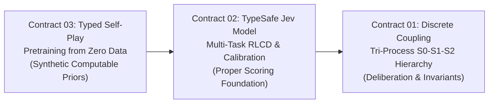

# JEV Research Roadmap: Contracts, Milestones & Frontiers

> **Date:** September 26, 2026  
> **Mission:** Building a General Foundation for Calibrated, Type-Safe Decision Intelligence.

---

## 🏛️ Strategic Research Architecture

The JEV research program is structured across three complementary contracts spanning the entire lifecycle of decision intelligence:

---

## 🧭 Contract Status & Milestones

### Contract 01: Discrete Invariant Coupling & Tri-Process Neural Hierarchy
* **Status:** Complete & Published (`contracts/01-discrete-coupling/`)
* **Milestones Completed:**
  - [x] **P1 Mazes (16x16):** Falsified continuous ERET recurrence; Adaptive ETS achieved 73% vs 1% ERET.
  - [x] **P2 Real-Time Tetris:** 100% win rate under dynamic clock allocation; reflexive drops on flat surfaces.
  - [x] **P3 5x5 Gardner Chess:** 32-0 tournament sweep via calibrated clock management.
  - [x] **P4 6x6 Los Alamos Chess:** 83.3% win rate (5-1) against fixed Depth 3.
  - [x] **P5 20-Hop Deduction:** 88.6% solve rate, eliminating 100% of orbital limit cycles.
  - [x] **P6 Countdown Arithmetic:** Discrete factor sub-goals boost accuracy to 58.0% with 29.5% fewer expansions.
  - [x] **P7 Mini-ARC Grids:** 100.0% exact-match inductive generalization with zero threshold leakage.
  - [x] **P8 Cellular Automata & VQ:** Shannon rate-distortion channel bounds with zero dead-neuron leakage.
* **Next Steps:** Integration into downstream multi-agent orchestration loops.

---

### Contract 02: TypeSafe Jev Decision Foundation Model (RLCD)
* **Status:** Scaled on Modal Cloud L40S (`contracts/02-rlcd-decision/`)
* **Milestones Completed:**
  - [x] **Fused Kernels:** Analytic closed-form Brier & RPS backward passes verified to $6.94 \times 10^{-18}$ precision.
  - [x] **Batched Option Gather:** 6.35x throughput acceleration on GPU option pooling.
  - [x] **Tasksource Multi-Task Ingestion:** Stratified pipeline over 5.3M examples (485 tasks) across 18 families.
  - [x] **Zero-Shot Generalization:** Strictly held-out validation on Commonsense, Paraphrase, and Fact Verification.
  - [x] **TypeSafe Drop-in Engine:** `openjev_engine.py` compatible with standard Jev wire format (`Choice`, `Score`, `Noul`).
* **Next Steps:** Full 450+ task Chinchilla-optimal pretraining run (Tier 3 on Modal L40S).

---

### Contract 03: Typed Self-Play Pretraining & Epiplexity (Zero Data)
* **Status:** Active Frontier (`contracts/03-typed-selfplay/`)
* **Milestones Completed:**
  - [x] **Theoretical Synthesis:** Formulated typed Solomonoff bet based on Cowsik et al. (2026) and Finzi et al. (2026).
  - [x] **Toy 1 (Typed Stack VM):** 0% syntax/runtime crashes across 5,000 generations (vs 99.3% in untyped Brainf\*ck).
  - [x] **Toy 2 (Epiplexity Zoo):** Evaluated 7 families (`iid`, `periodic`, `modadd`, `modmul`, `modadd_shuf`, `fsm`, `stack`); discovered negative transfer ($R = -0.151$, `modmul -> modadd`) and observer-relative invisibility.
* **Upcoming Milestones:**
  - [ ] **Milestone 3.1: Multi-Observer Hierarchy ($M_0 \to M_3$):** Test whether epiplexity proxy separates from raw difficulty when evaluated across a real spread of observer capacities (Markov Bigram $\to$ tiny MLP $\to$ looped MLP $\to$ compact Transformer).
  - [ ] **Milestone 3.2: Mechanistic Primitive Verification:** Define and check shared computational primitives (linear recurrence vs. cyclic group memorization) before testing family transfer.
  - [ ] **Milestone 3.3: Generator RL with Interference Penalty:** Implement policy gradient on typed programs with learning-progress reward penalized by negative transfer interference.
  - [ ] **Milestone 3.4: Zero-Shot Transfer to Natural Tasks:** Measure compute-optimal transfer scaling from pure synthetic typed pretraining to held-out real-world decision tasks.
