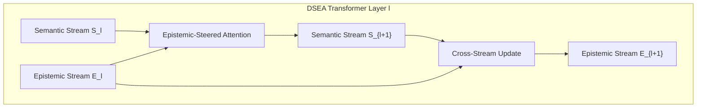

# Dual-Stream Epistemic Attention (DSEA)

## 1. Concept: Symbiosis of Meaning and Certainty
Large Language Models conflate **semantic representation** (what tokens mean) with **epistemic belief** (how confident or certain the model is about its inferences). 

In **Dual-Stream Epistemic Attention (DSEA)**, we decouple these two computational dimensions into two coupled streams running in parallel through the network:
* **Semantic Stream $S_l \in \mathbb{R}^{B \times T \times D}$:** The generative linguistic / symbolic representation.
* **Epistemic Stream $E_l \in \mathbb{R}^{B \times T \times D_e}$:** The non-generative, calibrated belief manifold (Jev state).

## 2. Epistemic Attention Steering
In standard self-attention:
$$A_{ij} = \text{softmax}\left(\frac{Q_S K_S^\top}{\sqrt{d}}\right)$$

In DSEA, the epistemic stream directly **steers the semantic attention matrix**:
$$A_{ij} = \text{softmax}\left(\frac{(Q_S)_i (K_S)_j^\top}{\sqrt{d}} + \beta \cdot \frac{(Q_E)_i (K_E)_j^\top}{\sqrt{d_e}}\right)$$

Where:
* $Q_E, K_E$ are projections of the epistemic belief state $E_l$.
* $\beta$ is a learnable scalar controlling the strength of epistemic bias.

### The Phenomenological Effect:
When the model reaches a critical structural junction (e.g. an unclosed bracket or an unresolved pointer), the epistemic stream focuses attention energy on the unresolved token. 
As revealed in our mechanistic interpretability inspection (**Figure 9B**), Layer 3 of DSEA produces a sharp, focused attention band onto Key Token 9 (the bracket pivot) across all queries!

## 3. Empirical Performance
* **Overall Holdout Accuracy:** 58.00%
* **Expected Calibration Error (ECE):** 1.30%
* **Attention Focus:** Strong localized epistemic steering on syntactic pivots.

See also: [[Activation-Biology-and-Residual-Gating]], [[EXP-001-Dyck-Hierarchical-Stack-Circuit]].
