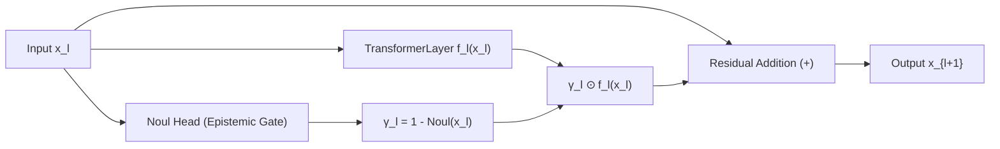

# Jev-Gated Residual (JGR) Architecture

## 1. First Principles & Motivation
In standard transformer architectures, the residual stream operates as a passive accumulator:
$$x_{l+1} = x_l + f_l(x_l)$$
Every layer $f_l$ blindly perturbs the representation, regardless of whether the underlying semantic representation has already arrived at a confident solution.

**Jev-Gated Residual (JGR)** transforms the residual connection into an active **epistemic valve**. Rather than allowing layers to run uninhibited, a non-generative Jev epistemic head evaluates the current latent state $x_l$ and modulates the perturbation:

$$\pi_l = \text{Noul}(x_l) \in [0, 1]$$
$$\gamma_l = 1 - \pi_l$$
$$x_{l+1} = x_l + \gamma_l \cdot f_l(x_l)$$

## 2. Mathematical Properties
1. **Dynamic Identity Collapse:**
   When the network reaches high epistemic confidence on reflexive instances ($\pi_l \to 1.0$), the gate collapses to $\gamma_l \to 0$.
   The layer reduces to the **identity operator**:
   $$x_{l+1} = x_l + 0 = x_l$$
   This prevents subsequent layers from distorting or over-thinking already resolved representations.
2. **Gradient Highway Preservation:**
   Because $\gamma_l$ is a smooth scalar in $[0, 1]$, backpropagation flows unimpeded through the skip connection:
   $$\frac{\partial \mathcal{L}}{\partial x_l} = \frac{\partial \mathcal{L}}{\partial x_{l+1}} \left( I + \gamma_l \frac{\partial f_l}{\partial x_l} + \frac{\partial \gamma_l}{\partial x_l} f_l(x_l) \right)$$
   The identity shortcut guarantees zero vanishing gradients.

## 3. Empirical Results (Stage A Dyck-3 Arena)
* **Overall Accuracy:** 58.00% (on balanced 5-depth grammar).
* **Expected Calibration Error (ECE):** **0.18%** (lowest of all tested architectures).
* **Observed Activation Biology:** 
  In Layer 0, the gate opens to $\gamma_0 \approx 0.43$. 
  In Layers 1, 2, 3, the gate automatically clamps to $\gamma \approx 0.02$, proving that the network learns to turn off subsequent layers when confidence is high.

See also: [[Activation-Biology-and-Residual-Gating]], [[EXP-001-Dyck-Hierarchical-Stack-Circuit]].
