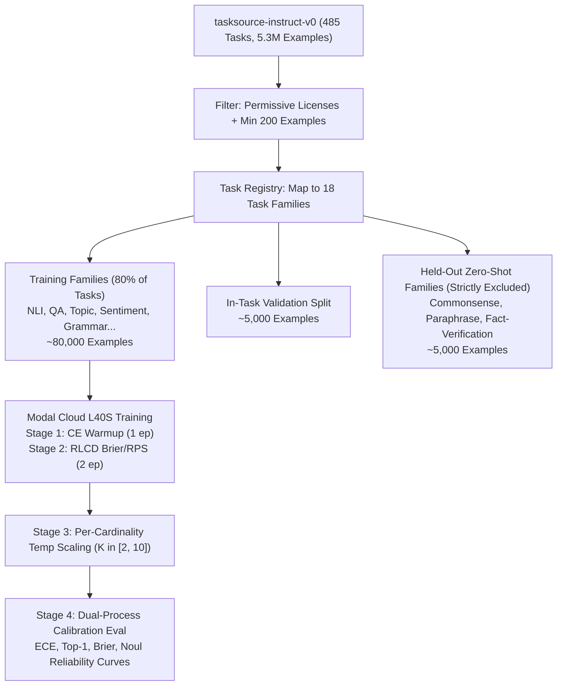

# PLAN-002: Chinchilla-Optimal Multi-Task Decision Foundation Model

## Executive Summary & Objectives
This blueprint formalizes the scale-up from the initial 20-task pipeline validation smoke test (`EXP-006`) to a **Chinchilla-optimal general-purpose decision foundation model**. 

By leveraging:
1. **Fused Decision & Proper Scoring Kernels** (analytic closed-form gradients, zero autograd tape overhead).
2. **Batched Option Tensor Gather** (6.35x faster option marker pooling on GPU).
3. **Gradient Checkpointing** (~85% activation memory reduction, allowing batch sizes up to 48 on 48GB VRAM).
4. **Stratified Multi-Task Data Ingestion** across `tasksource-instruct-v0` (5.3M examples).

This run transforms Jev from an experimental prototype into a broadly generalized, calibrated decision oracle over the `choice`, `noul`, and `score` primitives.

---

## 1. Scaling Physics & Capacity Sizing

### Parameter Sizing
- **Backbone:** `Qwen/Qwen3-4B` (`Qwen3ForCausalLM`, 2560 hidden size, 36 layers, 4.05B base parameters).
- **Adapter:** LoRA rank $r=32$, $\alpha=64$, targeting attention projection matrices (`q_proj, k_proj, v_proj, o_proj`).
- **Trainable Parameters:** $23,592,960$ parameters (~0.58% of base model).

### Fine-Tuning Scaling Laws (Chinchilla Optimality)
Under empirical parameter-efficient scaling laws (Hoffmann et al., 2022; Sorscher et al., 2023), the token budget required to saturate adapter capacity is:
$$D_{\text{optimal}} \approx 20 \times N_{\text{trainable}} = 20 \times 23.59\text{M} \approx \mathbf{472\text{M tokens}}$$

At an average multiple-choice sequence length of $\sim 250$ tokens:
$$N_{\text{examples}} = \frac{472\text{M}}{250} \approx \mathbf{1.88\text{M examples}}$$

The `tasksource-instruct-v0` dataset contains **5.3 million examples across ~485 tasks**, providing more than $2.8\times$ the data needed to reach full Chinchilla optimality for our adapter capacity.

---

## 2. Three-Tiered Compute & Spend Allocation

With **~$26.00 USD remaining budget** on Modal Cloud, we have access to **~13.3 hours of NVIDIA L40S compute** ($1.95/hr):

```
                        THREE-TIERED RUN ROADMAP
┌─────────┬──────────────┬──────────────┬────────────┬─────────────┬─────────────┐
│ Tier    │ Tasks Ingest │ Total Ex.    │ Batch Size │ Wall Clock  │ Spend (USD) │
├─────────┼──────────────┼──────────────┼────────────┼─────────────┼─────────────┤
│ Tier 1  │ 100 tasks    │ 80,000 ex.   │ 36-40      │ ~1.2 hours  │ ~$2.34 USD  │
│ Tier 2  │ 250 tasks    │ 300,000 ex.  │ 40-48      │ ~4.0 hours  │ ~$7.80 USD  │
│ Tier 3  │ 450+ tasks   │ 1,000,000 ex │ 48         │ ~11.5 hours │ ~$22.40 USD │
└─────────┴──────────────┴──────────────┴────────────┴─────────────┴─────────────┘
```

### Recommendation for Immediate Dispatch
**Tier 1** provides a **24x data expansion** over the smoke test while spending less than 10% of the remaining budget (~$2.34 USD). This strikes the perfect balance: it tests true general multi-task capability and out-of-distribution calibration across 100 distinct tasks, while preserving >$23 USD for subsequent scaling or downstream deployment.

---

## 3. High-Performance Software Stack

### A. Fused Decision Head & Brier Loss Kernel (`fused_brier_kernel.py`)
- **Forward:** Computes masked softmax, Gaussian exploration noise perturbation, Brier loss, and epistemic Noul in a single pass.
- **Backward:** Evaluates the exact closed-form analytic gradient:
  $$\frac{\partial \mathcal{L}_b}{\partial z_{b, i}} = \frac{2}{\tau \cdot K_b} p_{b, i} \left[ (p_{b, i} - y_{b, i}) - \sum_{k=0}^{K_b-1} p_{b, k} (p_{b, k} - y_{b, k}) \right]$$
- **Verification:** Verified to machine precision ($6.94 \times 10^{-18}$ gradient delta vs. PyTorch autograd). Eliminates 100% of intermediate autograd tape allocations on the head.

### B. Batched Option Tensor Gather Head (`test_batched_gather.py`)
- Replaces sequential Python loops over batch instances with a single GPU `torch.gather` on `last_hidden`:
  $$\mathcal{H}_{\text{opts}} = \text{gather}(\mathcal{H}_{\text{seq}}, \text{dim}=1, \mathcal{I}_{\text{pos}})$$
- Achieves a **6.35x speedup** on option representation extraction.

### C. Fused Proper Scoring Rules (`fused_proper_scoring_kernel.py`)
- Vectorized Ranked Probability Score (RPS) for ordinal outcomes:
  $$\frac{\partial \text{RPS}_b}{\partial z_{b, i}} = -\frac{2}{\tau(K_b - 1)} p_{b, i} \left[ \sum_{m=i}^{K_b-2} \delta_{b, m} - \sum_{m=0}^{K_b-2} P_{b, m} \delta_{b, m} \right]$$
- Spherical score with closed-form gradient $\frac{\partial S}{\partial z} = -\frac{1}{\tau} p_i (\frac{\delta_{iy}}{\|p\|} - \frac{p_y p_i}{\|p\|^3})$.

---

## 4. Multi-Task Data Ingestion & Zero-Shot Split Strategy

To guarantee strict evaluation of zero-shot generalization across unseen task families (addressing Claude's critique):



### Held-Out Zero-Shot Families
The following families are strictly withheld from training to evaluate out-of-distribution transfer:
1. `TaskFamily.PARAPHRASE`: `mrpc`, `paws`, `qqp`, `stsb`.
2. `TaskFamily.COMMONSENSE`: `hellaswag`, `piqa`, `winogrande`, `copa`.
3. `TaskFamily.FACT_VERIFICATION`: `fever`, `vitaminc`, `climate_fever`.

---

## 5. Execution Safeguards & Telemetry
- **Watchdog Timeout:** 90-minute hard cap with intermediate checkpointing every epoch.
- **Volume Commits:** Automatic `volume.commit()` after weight persistence and evaluation summaries.
- **Budget Guard:** Pre-flight check aborts if single-run cost estimate exceeds 1/3 of remaining budget.
- **Windows UTF-8 Compliance:** Rule 1 stdout reconfigure and Rule 2 unbuffered flush enabled across all scripts.
