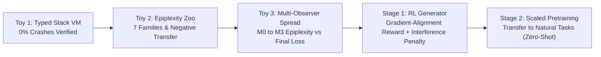

# PLAN-003: Typed Self-Play Pretraining & Epiplexity (Zero Data)

## Executive Summary & Objectives
This blueprint formalizes the research trajectory for **Contract 03: Typed Self-Play Pretraining & Epiplexity**, bridging the theoretical insights of *Self-Play Pretraining with Zero Data* (Cowsik et al., arXiv:2609.30063) and *Epiplexity* (Finzi et al., arXiv:2601.03220) into the TypeSafe Jev ecosystem.

The objective is to pretrain a Jev System 1 typed-decision model *tabula rasa*—using zero human or natural data—such that it acquires a general, reusable prior over structured decision processes and algorithmic invariants.

---

## 1. The Core Theoretical Bet

$$\text{Classical Solomonoff Pretraining (Cowsik 2026)} \quad \xrightarrow{\text{Types & Epiplexity}} \quad \text{Typed Jev Pretraining}$$

1. **Typedness as Validity Precondition:**
   - Solomonoff search over raw Brainf\*ck instruction sequences wastes >99% of compute on syntax errors, unbounded loops, or memory faults.
   - A *typed program space* (e.g. typed stack VM) enforces strict type validity: **0/5,000 crashes (0.0%)**.
2. **Epiplexity vs. Raw Difficulty:**
   - Difficulty can be manufactured by injecting unlearnable noise.
   - Epiplexity $S_{\mathcal{F}, T}(X) = \text{Loss}_0 - \text{Loss}_T$ isolates structural, learnable information for observer class $\mathcal{F}$.
3. **Negative Transfer Awareness:**
   - Surface similarity ("both modular arithmetic") does not guarantee positive transfer. As proven in Toy 2, `modmul -> modadd` produces severe negative transfer ($R = -0.151$).
   - Program pairings must share verified computational primitives (e.g., linear vs. periodic recurrence).

---

## 2. Experimental Milestones

### Phase 1: Multi-Observer Epiplexity Resolution (Immediate Crux)
- Deploy observer spread:
  - **$M_0$:** Bigram / $n$-gram Markov baseline.
  - **$M_1$:** Tiny order-$K$ MLP ($H=48$, current toy).
  - **$M_2$:** Medium looped MLP ($H=256$, deeper capacity).
  - **$M_3$:** Compact Decoder Transformer / Jevformer.
- Test whether the epiplexity ranking separates from raw difficulty as observer capacity increases.

### Phase 2: Primitive-Verified Family Pairing
- Classify generator families by underlying algebraic primitives:
  - **Affine Recurrence:** $x_{t+1} = (a x_t + b) \pmod P$
  - **Cyclic Group Memorization:** $x_{t+1} = (a x_t) \pmod P$
  - **Stack Push/Pop Memory:** Push, Dup, Pop, Apply
  - **Deterministic State Transition:** Directed graph walk
- Operationalize a priori primitive similarity metric before measuring transfer matrix $R(A \to B)$.

### Phase 3: Generator Policy Gradient with Anti-Interference Reward
- Augment the preconditioned gradient-alignment reward with an interference penalty:
  $$r(x) = |\langle \nabla_\theta \mathcal{L}(y_x), P_e \odot \delta\theta_e \rangle| - \lambda_{\text{interf}} \max(0, -R(x_{\text{prev}} \to x))$$

---

## 3. Reference Implementation & Working Spec
- **Contract Working Spec:** `contracts/03-typed-selfplay/SPEC.md`
- **Toy 2 Implementation:** `contracts/03-typed-selfplay/epiplexity_zoo_experiment.py`
- **Literature Notes:** [[Literature/Self-Play Pretraining with Zero Data]], [[Literature/Key-Literature-Index]]
- **Theory Notes:** [[Theory/Epiplexity-and-Bounded-Information]]
