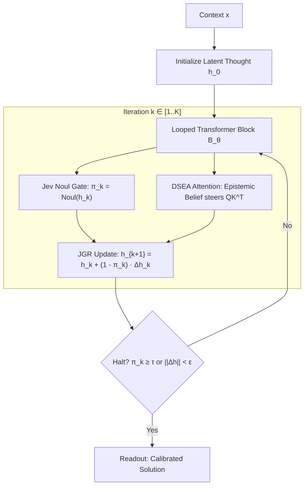

# Beyond Next-Token Prediction: Looped Transformers & Latent Equilibrium

## 1. The Architectural Satiation of Autoregression
Next-token prediction ($\mathcal{L} = -\sum \log P(x_{t+1} \mid x_{\le t})$) was the engine of the first phase of deep learning. But as we look at frontier reasoning in 2026, its fundamental limitation is glaring:
* **The Autoregressive Straightjacket:** It forces computation to proceed strictly one symbol at a time. The network cannot pause, backtrack, or form an uncommitted latent plan.
* **Uniformity of Depth:** Whether deciding a comma or resolving a mathematical induction, a feed-forward transformer executes the exact same static number of layer evaluations.
* **Latent Overthinking vs. Underthinking:** In simple contexts, deep layers perturb already-solved states; in hard contexts, shallow layers cannot represent multi-hop composition.

---

## 2. The Looped Transformer Paradigm
Instead of stacking hundreds of static layers, a **Looped Transformer** reuses a compact, highly expressive block of weights $\mathcal{B}_\theta$ iteratively:
$$h_{k+1} = \mathcal{B}_\theta(h_k, x)$$

### Key Theoretical Advantages:
1. **Decoupling Parameters from Reasoning Depth:** A 200M parameter looped block can execute 1, 4, 16, or 64 unrolled reasoning steps at test time.
2. **Latent Chains of Thought:** Thinking occurs not as verbose surface tokens, but as trajectories through continuous numerical state space.
3. **Fixed-Point Convergence:** Under contraction mapping conditions, $h_k$ converges to an internal equilibrium $h^*$ satisfying $h^* = \mathcal{B}_\theta(h^*, x)$.

---

## 3. Pervasive Jev Hybridization ("Epistemic Nervous System")
The hazard of recurrent depth is **uncontrolled drift and opacity**: without monitoring, latent states wander into hallucination manifolds. Jev provides the calibrated monitor at every tick of the loop:

1. **Jev-Gated Residuals (JGR) in the Loop:**
   $$h_{k+1} = h_k + (1 - \text{Noul}(h_k)) \cdot \Delta h_k$$
   When the thought converges ($\text{Noul} \to 1$), the loop automatically freezes into the identity operator.
2. **Dual-Stream Epistemic Attention (DSEA):**
   The epistemic belief state $E_k$ dynamically injects attention bias, steering the transformer heads toward the active contradiction or unresolved constraint.
3. **Epistemic Adaptive Computation Time (E-ACT):**
   Halting is governed by calibrated probability, not heuristic step counts.

---

## 4. Frontier Training Paradigms (Beyond Next-Token)

| Paradigm | State Representation | Training Objective | Role of Jev |
| :--- | :--- | :--- | :--- |
| **1. Latent Energy Equilibrium** | Continuous latent state $h \in \mathbb{R}^D$ | $\min_h E_\theta(x, h)$ via Lyapunov relaxation | Monitors convergence rate $\nabla E \to 0$ and certificates equilibrium validity |
| **2. Joint-Embedding Predictive (JEPA)** | Abstract semantic vectors $s_t, s_{t+1}$ | Non-contrastive representation matching ($\|s_{t+1} - \hat{s}_{t+1}\|^2$) | Measures Epiplexity ($S_{\mathcal{F}, T}$) and unpredictability of world transitions |
| **3. Continuous Thought Diffusion** | Sequence of noisy latent vectors | Denoising score matching / Flow-matching $\nabla_z \log p_t(z)$ | Evaluates per-token Signal-to-Noise Ratio (SNR) and stops denoising early |
| **4. Multi-Horizon Constraint Equilibrium** | 2D Grid / Graph Topological States | Global invariant / SAT constraint satisfaction | Calibrates whether the proposed trajectory satisfies boundary conditions |

See also: [[Epiplexity-and-Bounded-Information]], [[Jev-Gated-Residual-JGR]], [[Dual-Stream-Epistemic-Attention-DSEA]].
