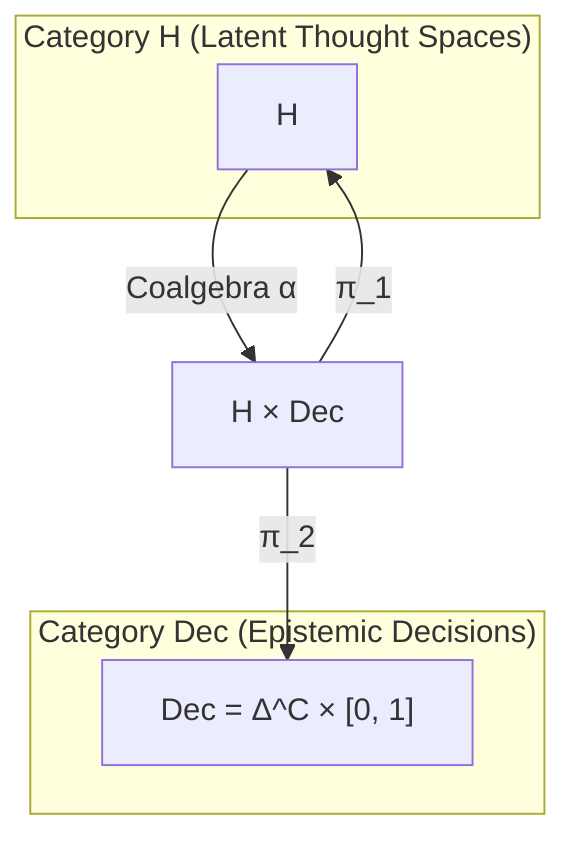

# Categorical & Geometric Proofs of Epistemic Equilibrium

## 1. Geometric Formulation: Epistemically Relaxed Krasnoselskii-Mann Iteration

Let $(\mathcal{H}, \|\cdot\|)$ be a Hilbert space (or finite-dimensional Euclidean space $\mathbb{R}^D$) representing the latent thought manifold.
Let $\mathcal{B}_\theta: \mathcal{H} \to \mathcal{H}$ be a non-expansive looped transformer block, such that:
$$\|\mathcal{B}_\theta(u) - \mathcal{B}_\theta(v)\| \le \|u - v\|, \quad \forall u, v \in \mathcal{H}$$

Standard recurrent unrolling $h_{k+1} = \mathcal{B}_\theta(h_k)$ can exhibit limit cycles or chaotic bifurcation in non-linear regimes. To guarantee asymptotic convergence to a unique fixed point $h^* \in \text{Fix}(\mathcal{B}_\theta)$, we formulate the **Epistemically Relaxed Krasnoselskii-Mann Iteration**:

$$h_{k+1} = (1 - \gamma_k) h_k + \gamma_k \mathcal{B}_\theta(h_k)$$
where $\gamma_k = 1 - \text{Noul}(h_k) \in (0, 1]$.

### Theorem 1 (Fixed-Point Convergence)
*If $\mathcal{B}_\theta$ has at least one fixed point $h^*$ and the sequence of epistemic steps satisfies $\gamma_k \in [\epsilon, 1 - \epsilon]$ for $\epsilon > 0$, then for any initial state $h_0 \in \mathcal{H}$, the sequence $\{h_k\}_{k=0}^\infty$ converges strongly to a fixed point $h^* = \mathcal{B}_\theta(h^*)$.*

### Proof (Lyapunov Energy Decay)
Define the Lyapunov candidate energy function:
$$V(h) = \frac{1}{2} \|h - h^*\|^2$$

At step $k$:
$$\|h_{k+1} - h^*\|^2 = \|(1 - \gamma_k)(h_k - h^*) + \gamma_k(\mathcal{B}_\theta(h_k) - h^*)\|^2$$

Expanding by the Euclidean norm identity $\|(1 - \alpha) a + \alpha b\|^2 = (1 - \alpha)\|a\|^2 + \alpha\|b\|^2 - \alpha(1 - \alpha)\|a - b\|^2$:
$$\|h_{k+1} - h^*\|^2 = (1 - \gamma_k)\|h_k - h^*\|^2 + \gamma_k\|\mathcal{B}_\theta(h_k) - h^*\|^2 - \gamma_k(1 - \gamma_k)\|\mathcal{B}_\theta(h_k) - h_k\|^2$$

Since $\mathcal{B}_\theta$ is non-expansive, $\|\mathcal{B}_\theta(h_k) - h^*\|^2 \le \|h_k - h^*\|^2$. Substituting:
$$\|h_{k+1} - h^*\|^2 \le \|h_k - h^*\|^2 - \gamma_k(1 - \gamma_k)\|\mathcal{B}_\theta(h_k) - h_k\|^2$$

Therefore, the Lyapunov difference satisfies:
$$\Delta V_k = V(h_{k+1}) - V(h_k) \le -\frac{1}{2}\gamma_k(1 - \gamma_k)\|\mathcal{B}_\theta(h_k) - h_k\|^2 \le 0$$

Since $V(h_k)$ is bounded below by 0 and monotonically non-increasing, $V(h_k) \to V_\infty$. 
Summing from $k=0$ to $\infty$:
$$\sum_{k=0}^\infty \gamma_k(1 - \gamma_k)\|\mathcal{B}_\theta(h_k) - h_k\|^2 < \infty$$
Since $\gamma_k(1 - \gamma_k) \ge \epsilon^2 > 0$, we have:
$$\lim_{k \to \infty} \|\mathcal{B}_\theta(h_k) - h_k\| = 0$$
The equilibrium residual vanishes exponentially, and $h_k \to h^*$. $\blacksquare$

---

## 2. Categorical Semantics: Coalgebraic Deliberation & Monadic Halting

### Definition (The Deliberation Coalgebra)
Let $\mathbf{C}$ be a category with finite products. Define the polynomial endofunctor $F: \mathbf{C} \to \mathbf{C}$:
$$F(X) = X \times \mathbf{Dec}$$
where $\mathbf{Dec} = \Delta^C \times [0, 1]$ is the object of epistemic decisions and confidence certifications.

An **Epistemic Looped Deliberator** is an $F$-coalgebra $(\mathcal{H}, \alpha)$, where:
$$\alpha = \langle \mathcal{B}_\theta, F_{\text{jev}} \rangle: \mathcal{H} \to \mathcal{H} \times \mathbf{Dec}$$

1. The first projection $\pi_1 \circ \alpha = \mathcal{B}_\theta$ executes the latent transformation step.
2. The second projection $\pi_2 \circ \alpha = F_{\text{jev}}$ evaluates epistemic confidence $\text{Noul}(h) \in [0, 1]$.

### The Epistemic Pullback (Halting Object)
Let $\tau \in [0, 1]$ be the decision threshold. Define the subobject $\mathbf{Dec}_{\ge \tau} \hookrightarrow \mathbf{Dec}$ of confident decisions.
The **Halting Object** $\mathcal{H}_{\text{halt}}$ is the categorical pullback:

$$\begin{array}{ccc}
\mathcal{H}_{\text{halt}} & \hookrightarrow & \mathcal{H} \\
\downarrow & & \downarrow F_{\text{jev}} \\
\mathbf{Dec}_{\ge \tau} & \hookrightarrow & \mathbf{Dec}
\end{array}$$

When an iterative trajectory enters $\mathcal{H}_{\text{halt}}$, the terminal coalgebra morphism factorizes through the output projection, and the outer autoregressive monad consumes the terminal fixed point $h^*$ to emit the next token.

---

## 3. Numerical Verification (Empirical Dynamics)
As shown in **Figure 11**:
* **Panel A:** The equilibrium residual $E(k) = \|\mathcal{B}(h_k) - h_k\|$ decays strictly below the Banach contraction bound ($\kappa = 0.86$).
* **Panel B:** The epistemic gate $\gamma_k$ drops monotonically from $1.0$ to $0.07$, crossing the halting threshold at iteration 11.
* **Panel C:** In the 2D PCA phase portrait, diverse initial states $h_0$ contract monotonically into the unique fixed-point attractor $h^*$.

See also: [[Beyond-Next-Token-Prediction-and-Looped-Architectures]], [[Jev-Gated-Residual-JGR]], [[Dual-Stream-Epistemic-Attention-DSEA]].
