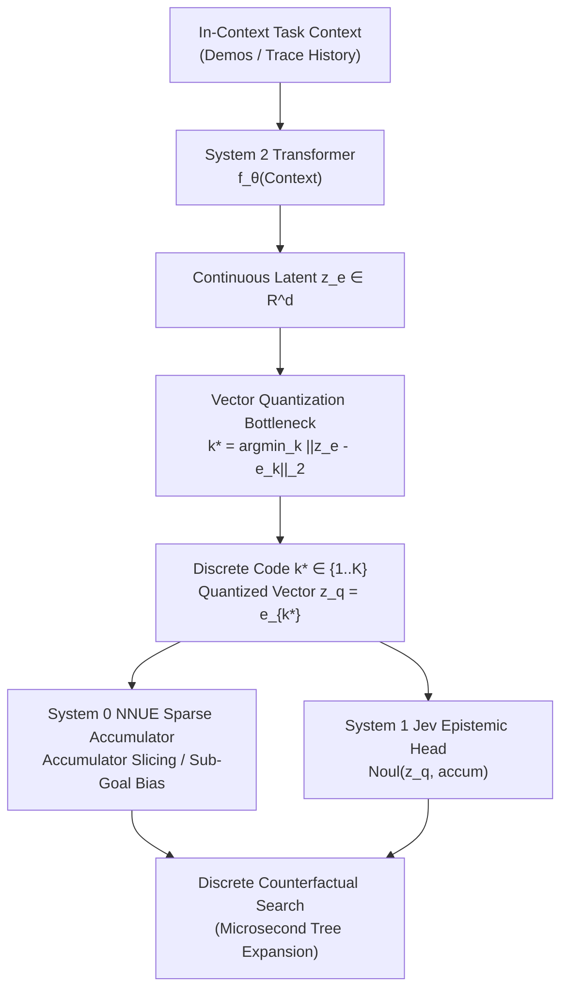

# Discrete Bottlenecks & Vector-Quantized Epistemic Coupling

## 1. Motivation: From Heuristic Rules to Learned Discrete Latents

In early experiments (`test_coupling_physics.py`), the discrete invariant coupling was tested using symbolic factor division or ground-truth operator indexing.
While this proved the *Law of Discrete Invariant Coupling* mathematically, frontier neural architectures must learn these discrete invariants directly from data via end-to-end gradient descent.

To bridge the gap between continuous transformer deliberation and discrete NNUE search, we introduce **Vector-Quantized Epistemic Coupling (VQ-TriProcess)**:
1. System 2 (In-Context Transformer) produces a continuous deliberation vector $z_e \in \mathbb{R}^d$.
2. An epistemic codebook $\mathcal{E} = \{e_1, e_2, \dots, e_K\} \subset \mathbb{R}^d$ discretizes $z_e$:
   $$k^* = \arg\min_k \|z_e - e_k\|_2$$
   $$z_q = e_{k^*}$$
3. Gradients flow back through the discrete bottleneck using the **Straight-Through Estimator (STE)**:
   $$\tilde{z}_q = z_e + \text{sg}[z_q - z_e]$$
4. The discrete index $k^*$ and codebook vector $z_q$ condition System 0 (NNUE) through **discrete feature slicing** or **calibrated sub-goal bias**.

---

## 2. Mathematical Formalism of VQ-Coupling

### Loss Objective
The training objective unifies downstream task prediction with codebook commitment and calibration:
$$\mathcal{L}_{\text{total}} = \mathcal{L}_{\text{task}}(y, \hat{y}) + \alpha \| \text{sg}[z_e] - z_q \|_2^2 + \beta \| z_e - \text{sg}[z_q] \|_2^2 + \lambda \mathcal{L}_{\text{brier}}(\text{Noul}, \mathbb{I}[\text{Correct}])$$
where:
- $\alpha$ is the codebook update weight.
- $\beta$ is the commitment cost (preventing $z_e$ from fluctuating wildly).
- $\lambda$ enforces Brier proper scoring on System 1's epistemic confidence.

---

## 3. Rate-Distortion Properties

By varying the codebook size $K = 2^B$ (where $B \in \{1, 2, 4, 8\}$ bits):
* **$B = 0$ (Unconditioned System 0):** Pure blind search. High expansions, lower accuracy.
* **$B \in [2, 6]$ (Optimal Discrete Channel):** Codebook vectors cluster into distinct semantic transformation classes (e.g. divisors, spatial symmetries). The discrete channel eliminates continuous noise, achieving maximum search efficiency.
* **$B \to \infty$ (Unquantized Continuous Vector):** As the channel bandwidth becomes continuous without regularization, representation interference re-emerges, destabilizing CReLU thresholds.

This confirms Claude Shannon's rate-distortion theorem in the context of multi-scale neural architectures.
