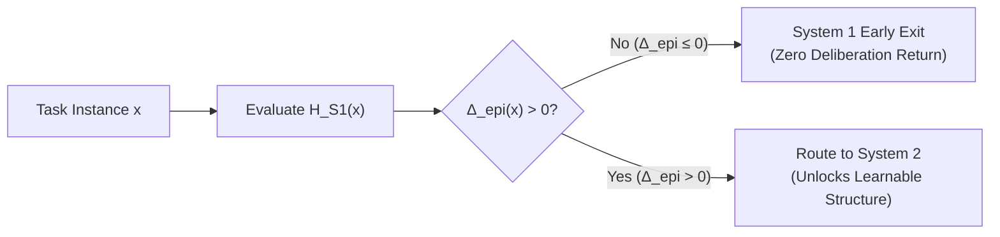

# Epiplexity & Bounded Information Theory

## 1. The Classical Illusion
Classical information theory evaluates information under an idealized observer with unbounded computational capacity:
* **Shannon Entropy ($H(X)$):** Assumes the observer can compute optimal probabilities across arbitrary joint distributions.
* **Kolmogorov Complexity ($K(x)$):** The length of the shortest program that generates $x$, uncomputable in finite time.

Under classical theory, a deterministic reasoning problem (such as evaluating a 10-hop graph or a 20-step proof) contains **zero information** if the rules and premises are present in the context. Yet for any physical machine—and any neural network—this information is inaccessible without executing computation.

---

## 2. The Epiplexity Formalism (Finzi, Wilson et al., 2026)
In *"From Entropy to Epiplexity: Rethinking Information for Computationally Bounded Intelligence"* ([arXiv:2601.03220](https://arxiv.org/abs/2601.03220)), Marc Finzi, Shikai Qiu, Yiding Jiang, Pavel Izmailov, J. Zico Kolter, and Andrew Gordon Wilson introduced **Epiplexity ($S_{\mathcal{F}, T}$)**.

For an observer constrained to function class $\mathcal{F}$ with computational budget $T$:
$$\text{Description Length} = S_{\mathcal{F}, T}(D) + H_{\mathcal{F}, T}(D)$$

Where:
* **$S_{\mathcal{F}, T}(D)$ (Epiplexity):** The structural, compressible information in data $D$ that the bounded observer can actually learn and extract.
* **$H_{\mathcal{F}, T}(D)$ (Time-Bounded Entropy):** The irreducible noise or computational pseudo-randomness that consumes budget without yielding usable structure.

---

## 3. Application to Jevformer: The Epiplexity Gap
In a dual-process architecture where System 1 has budget $T_1$ and System 2 has budget $T_2 > T_1$, we formalize instance-level difficulty via the **Epiplexity Gap**:

$$\Delta_{\text{epi}}(x) = H_{S1}(x) - H_{S2}(x)$$

### Regimes:
1. **Reflexive Regime ($\Delta_{\text{epi}}(x) \le 0, H_{S1}(x) \approx 0$):**  
   System 1 has already extracted all available structural bits. Deliberation is redundant.
2. **Deliberative Regime ($\Delta_{\text{epi}}(x) > 0$):**  
   System 1 experiences high time-bounded entropy ($H_{S1} \gg 0$), but System 2 can compress the structure ($H_{S2} \ll H_{S1}$). Compute investment yields high epistemic returns.
3. **Unlearnable / Intractable Regime ($\Delta_{\text{epi}}(x) \approx 0, H_{S1}(x) \approx H_{S2}(x) \approx \text{max}$):**  
   The task exceeds the circuit capacity of both systems without external memory or tools. The Jev epistemic head assigns low confidence, recognizing its own boundedness.

See also: [[RLCD-Proper-Scoring-Calibration]], [[EXP-002-Permutation-Path-Tracing-PCPR]].
