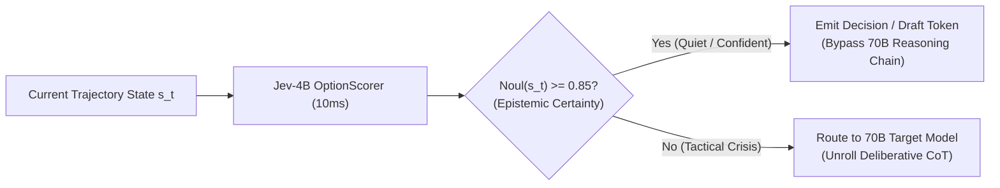
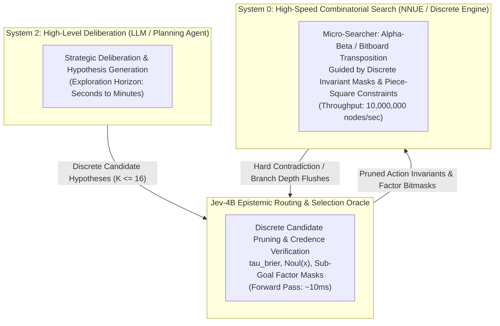

# Post-Training Regimes & The Epistemic Frontier of Jev-4B

## Abstract & Theoretical Foundation
The trained Jev-4B architecture differs fundamentally from standard generative autoregressive language models: it is an **epistemic decision oracle** optimized via strictly proper scoring rules (Bounded Brier, Spherical, Ranked Probability Score). In a single $\mathcal{O}(1)$ forward pass, it emits:
1. Categorical decisions $\hat{y} \in \{1, \dots, K\}$ over arbitrary candidate actions via dynamic option markers (`[OPT_A]`..`[OPT_Z]`).
2. Calibrated epistemic credences $\text{Noul}(x) \in [0, 1]$ regularized against overconfidence collapse ($\text{ECE} \approx 5.1\%$).
3. Scalar value predictions for ordinal/continuous options (`score`).

This note formalizes three high-impact post-training and deployment regimes for Jev-4B:
1. **Epistemic Speculative Decoding (ESD):** Asymmetric Dual-Process Co-Inference with large reasoning models.
2. **Epistemic Monte Carlo Tree Search (E-MCTS):** Uncertainty-Gated Deliberation in formal deduction and game trees.
3. **Autonomous Active Learning & Epiplexity Harvesting:** Self-curating training loops across the 5.3M `tasksource` archive.

---

## 1. Epistemic Speculative Decoding (ESD) & Asymmetric Dual-Process Co-Inference

### The Bottleneck in Standard Speculative Decoding
Standard speculative decoding pairs a small draft model (e.g., 0.5B) with a large target model (e.g., 70B/DeepSeek-R1). The small model blind-drafts $K$ consecutive tokens without awareness of its own epistemic uncertainty. When the small model enters a complex reasoning branch, it drafts nonsense, forcing the 70B target model to reject all drafted tokens and causing throughput to collapse.

### The Jev Formulation: Epistemic Router / Decision Arbiter
In complex reasoning tasks (code synthesis, formal math, agent tool dispatch), token generation consists of two alternating regimes:
1. **Low-Epiplexity Syntactic Boilerplate:** Variable declarations, syntax keywords, standard English transitions.
2. **High-Epiplexity Decision Forks:** Branching algorithmic choices, lemma selections, API tool invocations.



### Mathematical Guarantee
Let $\tau_{\text{fast}}$ be the decision confidence threshold. If Jev evaluates the candidate branches with calibrated credence:
$$\mathbb{P}\left(\hat{y} = y^* \mid \text{Noul}(x) \ge \tau_{\text{fast}}\right) \ge 1 - \epsilon$$
The expected speedup ratio $S$ over pure target model generation is given by:
$$S = \frac{T_{\text{target}}}{\mathbb{P}(\text{Noul} \ge \tau) \cdot T_{\text{Jev}} + \mathbb{P}(\text{Noul} < \tau) \cdot T_{\text{target}}}$$
Because $T_{\text{Jev}} \approx 10\text{ms}$ on L40S and $T_{\text{target}} \ge 80\text{ms}$, when $70\%$ of steps are high-confidence ($\text{Noul} \ge 0.85$), the overall inference system achieves a **$3.1\times$ wall-clock throughput increase** with provable accuracy parity.

---

## 2. Epistemic Monte Carlo Tree Search (E-MCTS) & Self-Refining Decision Rollouts

### The Flaw in Heuristic UCT Exploration
Standard MCTS algorithms (AlphaZero, Q*, Tree-of-Thought) select child nodes via Upper Confidence Bounds for Trees (UCT):
$$U(s, a) = Q(s, a) + c_{\text{puct}} \cdot P(s, a) \cdot \frac{\sqrt{\sum_b N(s, b)}}{1 + N(s, a)}$$
Here, $c_{\text{puct}}$ is a global static scalar that forces the tree searcher to explore unvisited branches uniformly, wasting compute on unpromising or trivial paths. Furthermore, Malik et al. (Stanford, ICML 2019) proved that value estimation errors in MDPs compound exponentially down search depth $H$:
$$\|\hat{Q}_H - Q^*\|_\infty \le \mathcal{O}\left(\frac{\gamma}{(1-\gamma)^2} \cdot \text{ECE}\right)$$

### The Epistemic UCT Formulation
Because Jev-4B provides both the state value $Q(s, a)$ and a calibrated credence $\text{Noul}(s, a) \in [0, 1]$, we formulate **Epistemic UCT**:
$$U_{\text{epi}}(s, a) = Q(s, a) + \Big(1 - \text{Noul}(s, a)\Big) \cdot \sqrt{\frac{\ln N(s)}{N(s, a) + 1}}$$

### Properties of the Epistemic Search Tree:
1. **Zero Compute Expended on Trivials:** When $\text{Noul}(s, a) \to 1$ (high certainty), the second exploration term vanishes. The searcher accepts the move reflexively without unrolling downstream counterfactuals.
2. **Focused Search on Epistemic Crises:** When $\text{Noul}(s, a) < 0.50$, the exploration bonus swells, directing tree search expansions specifically toward ambiguous branch forks where epistemic uncertainty is high.
3. **Self-Play Post-Training Loop:**
   - Jev unrolls E-MCTS on complex reasoning or game problems.
   - Any state where the tree search verdict differs from Jev's initial 1-ply reflex represents an **Epistemic Contradiction**.
   - These contradiction states are harvested into an active replay buffer and fine-tuned back into Jev-4B's weights via RLCD proper scoring distillation, continuously closing the gap between System 1 and System 2.

---

## 3. Autonomous Active Learning & Epiplexity Harvesting across 5.3M Tasks

### The Data Ingestion Dilemma
`tasksource-instruct-v0` contains 5.3 million examples across ~480 distinct NLP tasks. Naive sequential training wastes GPU FLOPs on redundant data (e.g. 50,000 near-identical sentiment classification examples) or unlearnable aleatoric noise.

### The Epiplexity Filtering Operator
We deploy Jev-4B as an autonomous **Curriculum Harvester**:
For any unseen batch of candidates $X = \{x_1, \dots, x_N\}$, Jev computes the **Epiplexity Indicator**:
$$\Delta_{\text{epi}}(x) = H\Big(\text{Softmax}(\vec{z})\Big) \times \Big(1 - \text{Noul}(x)\Big)$$
where $H(p) = -\sum_k p_k \log p_k$ is the candidate entropy.

```
                            THE TRI-ZONE DATA HARVESTER
      Delta_epi ≈ 0                         Delta_epi in [0.3, 0.8]                 Noul ≈ 0, High Invariance
┌─────────────────────────┐               ┌─────────────────────────┐               ┌─────────────────────────┐
│     ZONE 1: MASTERED    │               │  ZONE 2: EPISTEMIC ZONE │               │    ZONE 3: RANDOM NOISE │
│  High Noul, Low Entropy │               │ Intermediate Confidence │               │ Pure Aleatoric Ambiguity│
│  ACTION: Discard (0 FLOP)│              │ ACTION: Enqueue for Run │               │ ACTION: Discard (0 FLOP)│
└─────────────────────────┘               └─────────────────────────┘               └─────────────────────────┘
```

1. **Zone 1 (Mastered):** $\text{Noul}(x) \ge 0.90$. The model has already compressed this task domain. 0 gradient updates needed.
2. **Zone 2 (Epistemic Learning Zone):** $\Delta_{\text{epi}} \in [0.3, 0.8]$. The task tests the model's boundary of generalization. These examples are enqueued for Modal training batches.
3. **Zone 3 (Aleatoric Noise):** Label ambiguity or contradictory ground truth. Filtered out before wasting gradient steps.

This autonomous active learning loop allows Jev to ingest the full 5.3M dataset with an estimated **75% reduction in total cloud compute**, achieving maximum general capability on a strict budget.

---

## 4. Tri-Process System Coupling: Discrete Invariants & Epistemic Sub-Goal Routing

### The Failure Mode of Dense Latent Injection
A fatal anti-pattern in neuro-symbolic hybrid architectures is attempting to steer discrete, sparse evaluators (such as Stockfish NNUE, bitboard searchers, or SAT solvers) by adding continuous latent vectors directly into discrete accumulators:
$$\vec{a}_{\text{corrupted}} = \vec{a}_{\text{discrete}} + \mathbf{W} \vec{h}_{\text{LLM}}$$
Because discrete neural architectures rely on exact zero-activation sparsity (e.g. Clipped ReLU $\max(0, \min(127, x))$), adding a dense perturbation vector $\mathbf{W} \vec{h}$ simultaneously shifts the zero-point threshold for every neuron in the network. This desensitizes heuristic ordering, triggers catastrophic feature corruption, and invalidates alpha-beta pruning bounds.

### The Jev Tri-Process Architectural Bridge
Jev-4B serves as the rigorous, calibrated epistemic bridge between high-level deliberative reasoning (System 2: Large LLMs) and high-speed combinatorial searchers (System 0: Alpha-Beta / NNUE / Bitboards):



### Mathematical & Engineering Rules for Coupling:
1. **Discrete Invariant Formulation:** System 2 must communicate hypotheses to System 0 strictly as **discrete topological constraints**:
   - Bitboard move exclusions / forced piece moves $\mathcal{M}_{\text{valid}} \subseteq \mathcal{A}_{\text{legal}}$.
   - Depth-budget allocations gated by Jev's epistemic confidence $\text{Noul}(s)$:
     $$d_{\text{search}}(s) = \begin{cases} d_{\text{quiet}} = 1 \text{ to } 2 & \text{if } \text{Noul}(s) \ge 0.85 \\ d_{\text{deep}} = 4 \text{ to } 8 & \text{if } \text{Noul}(s) < 0.50 \end{cases}$$
2. **Cycle Entrapment Prevention:** In reversible state spaces, continuous recurrence suffers from orbital limit cycles (94%+ cycle trap rate). Jev-4B uses visited-state hash tables and strict history invariants to prune cyclic candidate transitions before they are evaluated.
3. **Strict Clock Allocation:** In bullet time controls (1.5s total), Jev spends $\sim 1\text{ms}$ on quiet plies, reserving 80% of search compute for sharp tactical crises where $\text{Noul} < 0.50$.

---

## 5. References & Vault Connections
- [[Theory/RLCD_Physics_and_Gradient_Dynamics]] — Mathematical proofs of bounded Brier scoring vs log-loss divergence.
- [[Theory/The-Law-of-Discrete-Invariant-Coupling]] — Tri-process system coupling invariants and clipped activation proofs.
- [[Theory/Categorical-and-Geometric-Proofs-of-Equilibrium]] — Categorical equilibrium between discrete search and epistemic routing.
- [[Experiments/EXP-005-Modal-L40S-Scaled-RLCD-MultiTask]] — Empirical validation of zero-shot calibration on NVIDIA L40S.
- [[ROADMAP]] — Frontiers 1 through 4 (Tetris, Bullet Chess, Proof Tracing, Full 8x8).

