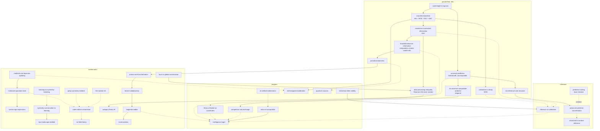

# MAP: how the ideas connect

Solid arrows are established relations. Dotted arrows are conjectures or speculation. Each node is one note.

```mermaid
flowchart TD
  subgraph F[ground floor: bits]
    CL[code-length-is-log-loss] --> CORP[corp-decomposition<br/>bits = MCB - DSC + UNC]
    CORP --> CC[calibration-is-cheap<br/>MCB]
    CORP --> RES[resolution-is-extracted-information<br/>DSC]
    RES --> DPI[data-processing-inequality<br/>Shannon info never created]
    RES --> BOI[bounded-observer-information<br/>computation creates usable info]
    BOI --> PR[pseudorandomness]
    CL --> UP[universal-prediction<br/>Solomonoff, uncomputable]
    UP --> NUC[no-universal-computable-predictor<br/>diagonal]
    UP --> CTW[ctw-inference-over-structure]
  end
  subgraph I[inference]
    CTW --> J[jumps-are-posterior-concentration]
    J -.-> AIC[amortized-in-context-inference]
    PC[predictive-coding<br/>local, iterative] -.contrast.- J
    CC -.-> IVC[inference-vs-calibration]
    RES -.-> IVC
  end
  subgraph M[mathematics]
    MED[mediants-are-bayesian-updating] --> MQ[minkowski-question-mark]
    MQ --> SUR[surreal-sign-expansions]
    MQ -.-> CLM[codes-lattices-moonshine]
    SYM[symmetry-conservation-in-learning] --> ORB[loss-landscape-orbifold]
    CLM -.-> NFT[nn-field-theory]
    CAT[category-theory-fit]
    GOL[golay-symmetry-testbed] -.-> CLM
    LSB[learning-as-symmetry-breaking] -.-> SYM
    PRI[primes-are-the-information] --> HEC[hecke-multiplicativity]
    HEC --> LAN[langlands-ladder]
    LAN --> MUR[murmurations]
    N24[the-number-24] -.-> CLM
    LGC[local-vs-global-conservation] --> DPI
  end
  subgraph P[program]
    LOB[library-of-babel-as-coordinates]
    CE[competition-and-exchange]
    VOC[value-of-computation]
    KK[kahneman-klein-validity]
    MDL[mdl-snapped-recalibration]
    QS[quantum-sources]
    IT[intelligence-target]
    AIV[ai-verified-mathematics]
  end
  PR --> PRI
  AIV -.-> VOC
  LAN -.-> IT
  UP -.-> LOB
  NUC --> CE
  DPI --> CAT
  MED -.-> MDL
  CORP --> MDL
  PR -.-> QS
  IVC -.-> IT
  BOI -.-> IT
  LOB -.-> IT
  CE -.-> IT
  VOC --> IT
  KK --> IVC
```
